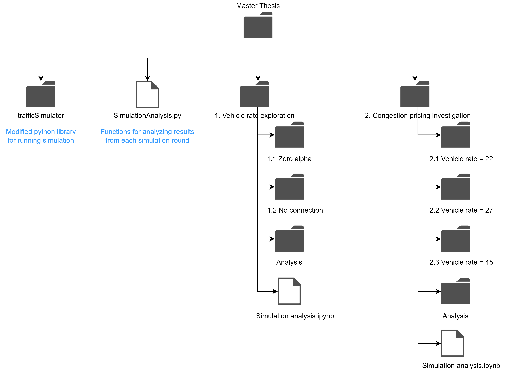

# Overview
This repository contains all the codes and simulation output data for the submitted thesis `Braess Paradox in Congestion Pricing`.

# Folder structure
## Overall folders/files
The folders and files in this repository can be described as shown below (please note that only the folders and files that are important to the simulations are presented here):

- `trafficSimulator`: a python library which is used to generate simulations. It is a modified version of the package from https://github.com/BilHim/trafficSimulator.
- `SimulationAnalysis.py`: contains functions needed to compute the utility and probabilities values for each route after each simulation round is completed.
- `1. Vehicle rate exploration`: performs the simulations for the preparation phase of the thesis, where the vehicle rate parameter is varied for the case of no congestion pricing with no middle connection and the case of no congestion pricing with middle connection. It also stores the relevant outcomes.
- `2. Congestion pricing investigation`: performs the simulations for the investigation phase of the thesis, where 3 vehicle rates are separately explored with different scenarios and cases (please refer to the thesis for more information regarding the definition of scenario and case here).

## Contents of "trafficSimulator"
This section will describe the parts of the "trafficSimulator" package that have been modified and used in this thesis:
- `window.py`: defines the overall graphic output of a simulation and terminates the simulation when certain conditions are met. To be more specific, for this thesis, when all the vehicles have reached their destinations, the simulation will be terminated.
- `vehicle_generator.py`: based on the input regarding each vehicle's preferences for each route, this script chooses a route for each vehicle for the current round. In addition, depending on the current vehicle rate parameter, the script generates new vehicle into the system as long as a certain time interval has passed since the last vehicle is generated, and as along as the vehicle limit specified (in this thesis the vehicle limit is 80) is not exceeded.
- `road.py`: defines the road properties and how they should be updated in each frame of the simulation.
  * The relevant properties include the waiting time, the length of the stop zone, and the speed limit of the road, as well as the vehicles currently driving in the road.
  * The main updating logic is to loop through all the vehicles in the road and adjust their desired speed so that they are aligned with the road's speed limit.
- `vehicle.py`: defines the vehicle properties and how they should be updated in each frame of the simulation.
  * The relevant properties include the length, the maximum acceleration/deceleration levels, the label, and total travel time of the vehicle, as well as the index of the road that it's driving on.
  * The main updating logic is to adjust the vehicle's velocity for the next time point, and adjust its acceleration based on various conditions. The adjustment of the acceleration is often based on the Intelligent Driver Model. The update also includes increasing the total travel time and/or changes in the vehicle's leading vehicle, etc., which is then recorded in a dataframe.
- `simulation.py`: defines the properties of the simulation itself and how it should be updated for each frame.
    * The relevant properties include the duration, the preference of each vehicle, and the collected data regarding the vehicles.
    * The main updating logic is as follows:
        * First, it loops through every road in the network
        * For each road, it loops through every vehicle in the corresponding road (if there is any)
        * When vehicles have entered the stop zone of the current road, check for the corresponding conditions to determine if any changes are needed, for example, if the vehicle needs to be popped from the current road and appended to the next.
        * In addition, the update always checks if the condition for terminating the simulation is met. In other words, it checks if all the vehicles have reached the destination.

# Dependencies
- To run the `trafficSimulator` package, the libraries of `numpy`, `pygame`, `pandas`, and `scipy` are required.
- To generate the visualizations plotted in the `Simulation_analysis.ipynb` files, the library `matplotlib` also needs to be installed.

# Other comments
  * While the codes in this repository have be modularized by sharing the `trafficSimulator` package and the functions in `SimulationAnalysis.py`, there's no doubt that many more improvements can be made. For example, in each script that runs the simulation, the functions for performing the simulation are almost identical for each case.
  * A more standardized pipeline can also be built to perform the flow of running the simulation for each scenario and case and store the relevant data automatically.
  * The modifications made to the `trafficSimulator` have made the computation needed much higher than before and therefore it takes much longer to complete one round of simulation. Therefore, ways of increasing its efficiency need to be further explored.
